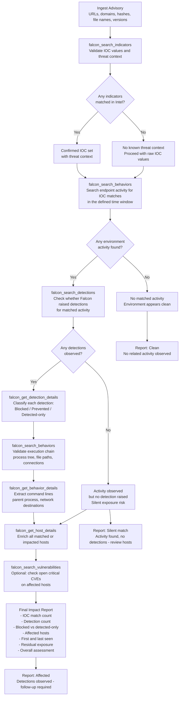

write me the technical use case with data flow and in mermaid

Here is the full technical use case document for this supply-chain exposure validation workflow, based on the Checkmarx / Open VSX event in the screenshot. [1][2]

***

## Use Case

**Use case name:** Supply-chain package exposure validation

**Purpose:**
Determine whether any endpoints in the environment interacted with the reported Checkmarx VSIX packages from the Open VSX registry, whether CrowdStrike generated detections for related activity, and whether any blocking or prevention occurred.

**When to use it:**
- An external team or CIG sends an advisory about a supply-chain event.
- You receive specific package names, URLs, file names, hashes, or registry sources tied to a potential compromise.
- You need to answer "are we impacted?" before escalating or responding to the requestor.
- You want to provide a fast, evidence-based answer without manually pivoting across multiple Falcon console tabs.

**Primary value:**
This use case turns an inbound advisory into a structured environment impact check by correlating threat indicators, endpoint behaviors, detections, and host context in one workflow. It answers both the presence question ("did we see this?") and the protection question ("did Falcon stop it?"). [1][2][3]

***

## User prompt

```text
Assess exposure to the Checkmarx / Open VSX supply-chain event.

Scope:
- Source registry: open-vsx.org
- Extensions:
  - https://open-vsx.org/extension/checkmarx/cx-dev-assist
  - https://open-vsx.org/extension/checkmarx/ast-results
- Versions:
  - ast-results-2.53.0.vsix
  - cx-dev-assist-1.7.0.vsix
- SHA hashes: [attach SHA file from advisory]
- Time window: 2026-03-25 to present

Tasks:
1. Search for related indicators using the domains, URLs, file names, hashes,
   and package names from the advisory.
2. Check whether any matched indicators appear in endpoint activity in my environment.
3. Check whether CrowdStrike generated detections for any related activity.
4. Retrieve detection details and classify each as blocked/prevented or detected-only.
5. Search for related behaviors on the same hosts and timeframe.
6. Retrieve host details for all matched or impacted endpoints.
7. Optionally check whether affected hosts still have open critical vulnerabilities.
8. Return a report with:
   - whether any related activity was observed
   - whether CrowdStrike generated detections
   - total detections
   - total blocked or prevented events
   - affected hostnames and host groups
   - first seen and last seen timestamps
   - whether any host had repeated related activity
   - overall assessment: clean, partially affected, or requires follow-up
```

***

## Data flow

### Flow summary

1. **Ingest advisory details**
Extract IOC values from the advisory or ticket — domains, URLs, file names, package names, SHA hashes, and version strings. Define the investigation time window from the advisory date onward. [1][2]

2. **Validate indicator context**
Look up the submitted indicators in threat intelligence to confirm type, reputation, and any related campaign or threat context. This step validates that the IOC set is accurate before checking internal activity. [2][3]

3. **Check for environment matches**
Search endpoint activity for any matches to those indicators within the defined time window to determine whether any host interacted with the reported packages or infrastructure. [2][4]

4. **Check for CrowdStrike detections**
For any matched activity, query detection data to confirm whether Falcon raised a detection event. This separates hosts where activity was observed from hosts where Falcon actively flagged it. [5][4]

5. **Classify detection outcomes**
Retrieve detection details and classify each event as blocked or prevented versus detected-only. This answers whether Falcon stopped the activity or only observed it. [2][3]

6. **Validate with behavior data**
Search behavior records on the same hosts and timeframe to confirm the execution chain, process names, file paths, and any network connections tied to the activity. [2]

7. **Enrich with host context**
Retrieve host-level details for all matched or impacted endpoints to scope the results by hostname, operating system, host group, and last-seen time. [2][3]

8. **Optional residual exposure check**
Review whether affected hosts still carry unresolved critical vulnerabilities that may require additional remediation beyond detection cleanup. [6][3]

9. **Generate final report**
Produce a concise impact summary that states whether the environment appears clean, partially affected, or requires follow-up, with supporting counts and host details. [2][3]

***

### Input and output mapping

| Stage | Input | Processing | Output |
|---|---|---|---|
| Advisory intake | URLs, domains, file names, hashes, versions, time window | Normalize and categorize by indicator type | Clean IOC input set [1][2] |
| Indicator validation | IOC values | Confirm threat context from Falcon Intel | Verified IOC set with threat context [3] |
| Environment match | Verified IOC set, time window | Check endpoint activity for IOC presence | Matched and unmatched IOC results [4] |
| Detection confirmation | IOC matches, time window | Check whether Falcon raised detection events | Detection count per IOC and per host [5] |
| Outcome classification | Detection IDs | Retrieve details and classify blocked vs detected-only | Prevention and detection-only count [2] |
| Behavior validation | Matched hosts, time window | Confirm execution chain and network connections | Process tree, command lines, file paths [2] |
| Host enrichment | Matched hosts | Retrieve host context | Hostname, OS, group, last seen [3] |
| Exposure check | Affected hosts | Check unresolved critical vulnerabilities | Residual risk per host [6] |
| Reporting | All results | Summarize impact | Clean / affected / follow-up verdict [3] |

***

## Expected result

```text
Supply-Chain Exposure Validation Report

- Event: Checkmarx / Open VSX supply-chain advisory
- Time window: 2026-03-25 to present
- IOC values reviewed: [count from advisory]
- Environment matches found: [count]
- CrowdStrike detections observed: Yes / No
- Total detections: [count]
- Total blocked / prevented: [count]
- Detection-only events: [count]
- Affected hosts: [count]
- Hostnames: [list]
- Host groups: [list]
- First seen: [date]
- Last seen: [date]
- Repeated activity on same host: Yes / No
- Residual exposure: [open critical CVEs on affected hosts if applicable]
- Overall assessment: Clean / Partially affected / Follow-up required
```

***

## Mermaid diagram



***

## Key interpretation

- **No matches and no detections:** Environment appears clean for this advisory. Document and close. [2]
- **Matches found but no detections:** Activity observed without a Falcon alert — possible telemetry gap, low-confidence activity, or missed detection. Treat as risk requiring manual host review. [7]
- **Matches found and detections raised:** Confirmed environment impact. Separate blocked events from detection-only events and remediate any host where activity was not stopped. [1][2][4]


